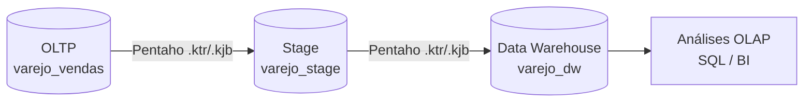
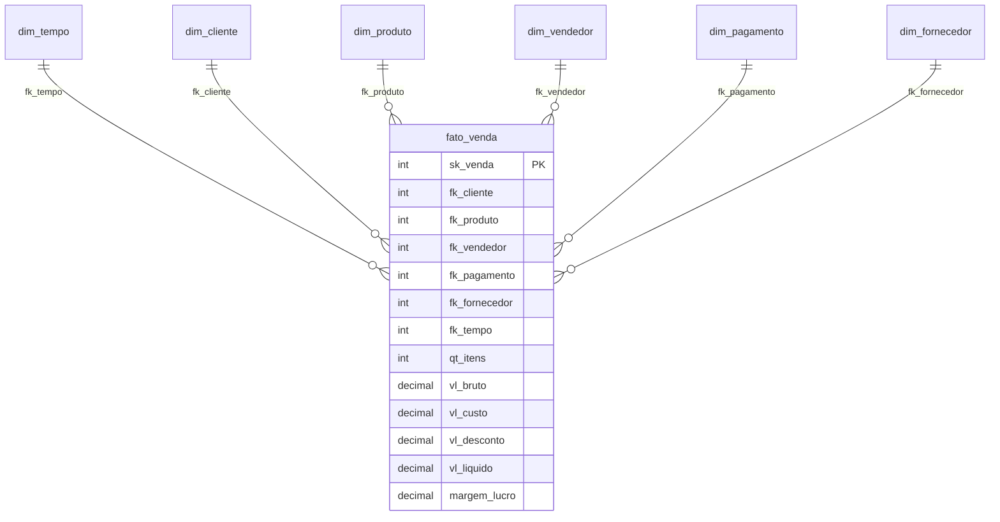
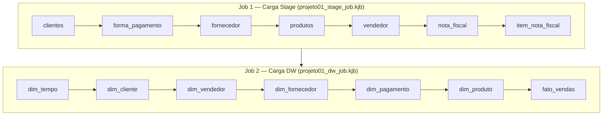

# 🛒 Varejo Vendas Brasil — Data Warehouse & BI

**Projeto de Engenharia de Dados e Business Intelligence** aplicado a uma empresa de varejo de médio porte com operações físicas e e-commerce. Pipeline completo de ETL com Pentaho, modelagem Star Schema em PostgreSQL e análises OLAP.

---

## 📌 Contexto do Problema

A **Varejo Vendas Brasil** opera desde 2015 no segmento de eletrônicos, eletrodomésticos e utilidades domésticas. Com o crescimento acelerado, os dados operacionais explodiram — centenas de notas fiscais por dia, múltiplos canais de venda, equipe comercial distribuída — mas a capacidade analítica não acompanhou o ritmo.

| Dor | Solução aplicada |
|-----|-----------------|
| Relatórios manuais e inconsistentes | Camada Stage com padronização via Pentaho |
| Impossível cruzar vendas × produtos × vendedores | Star Schema com 6 dimensões integradas |
| Sem visão histórica consolidada | Dim_Tempo com granularidade diária e suporte a YTD/MoM |
| Decisões por intuição | Consultas OLAP com KPIs de margem, ranking e sazonalidade |

---

## 🏗️ Arquitetura da Solução



**Camadas do pipeline:**

- **OLTP** — banco transacional com dados operacionais brutos
- **Stage** — limpeza, padronização de tipos e tratamento de nulos, orquestrado com Jobs do Pentaho (`.kjb`)
- **DW** — modelo dimensional Star Schema pronto para análise

---

## 📐 Modelagem — Star Schema



---

## 🛠️ Stack Tecnológica

| Categoria | Tecnologia |
|-----------|-----------|
| Banco de dados | PostgreSQL 15 |
| ETL | Pentaho Data Integration (PDI / Kettle) |
| Orquestração | Pentaho Jobs (`.kjb`) |
| Transformações | Pentaho Transformations (`.ktr`) |
| Modelagem e DDL | SQL |
| Versionamento | Git / GitHub |

---

## 📂 Estrutura do Repositório

```
varejo-vendas-brasil-dw/
│
├── Banco Relacional/
│   └── varejo_vendas_brasil.sql      # DDL do banco transacional (OLTP)
│
├── Stage Banco/
│   └── varejo_stage.sql              # DDL da camada Stage
│
├── DataWarehouse Banco/
│   └── varejo_data_warehouse.sql     # DDL do DW (Star Schema)
│
├── KTR/
│   ├── Jobs/
│   │   ├── projeto01_stage_job.kjb   # Orquestrador da carga Stage
│   │   └── projeto01_dw_job.kjb      # Orquestrador da carga DW
│   │
│   ├── projeto01_stage_clientes.ktr
│   ├── projeto01_stage_forma_pagamento.ktr
│   ├── projeto01_stage_fornecedor.ktr
│   ├── projeto01_stage_item_nota_fiscal.ktr
│   ├── projeto01_stage_nota_fiscal.ktr
│   ├── projeto01_stage_produtos.ktr
│   ├── projeto01_stage_vendedor.ktr
│   │
│   ├── projeto01_dw_cliente.ktr
│   ├── projeto01_dw_forma_pagamento.ktr
│   ├── projeto01_dw_fornecedor.ktr
│   ├── projeto01_dw_produto.ktr
│   ├── projeto01_dw_tempo.ktr
│   ├── projeto01_dw_vendedor.ktr
│   └── projeto01_dw_fato_vendas.ktr  # Executada por último
│
└── README.md
```

---

## 🔄 Fluxo de Execução do ETL



> ⚠️ A `fato_vendas` é sempre carregada por último — depende de todas as dimensões já populadas.

---

## 📊 Perguntas de Negócio Respondidas

- 📅 **Sazonalidade:** Como evoluíram as vendas por mês e categoria nos últimos anos?
- 🧍 **Performance comercial:** Quais vendedores lideram por trimestre?
- 💰 **Rentabilidade:** Quais produtos e categorias geram maior margem de lucro?
- 🌍 **Fornecedores:** Quais concentram maior volume de produtos vendidos?
- 🧾 **Meios de pagamento:** Quais formas são mais usadas e em que perfil de compra?

---

## 🚀 Como Executar

**Pré-requisitos:** PostgreSQL instalado + Pentaho Data Integration (Community Edition)

### 1. Clone o repositório

```bash
git clone https://github.com/alanoregis/varejo-vendas-brasil-dw.git
cd varejo-vendas-brasil-dw
```

### 2. Execute os scripts SQL na ordem

```sql
\i "Banco Relacional/varejo_vendas_brasil.sql"
\i "Stage Banco/varejo_stage.sql"
\i "DataWarehouse Banco/varejo_data_warehouse.sql"
```

### 3. Configure a conexão no Pentaho

Abra o PDI e configure a conexão com o PostgreSQL (host, porta, usuário e senha).

### 4. Execute os Jobs na ordem

```
1. KTR/Jobs/projeto01_stage_job.kjb
2. KTR/Jobs/projeto01_dw_job.kjb
```

---

## 📈 Resultados

- ✅ 14 transformações `.ktr` versionadas (7 Stage + 7 DW)
- ✅ Star Schema com 6 dimensões e 1 tabela fato pronta para análise OLAP
- ✅ Separação clara entre camadas OLTP, Stage e DW
- ⏱️ Tempo de geração de relatórios: de dias → minutos

---

## 👨‍💻 Autor

**Alano Regis Milfont** — Engenheiro de Dados Júnior | Analista de Dados

[](https://linkedin.com/in/alanoregis)
[](https://github.com/alanoregis)
[](mailto:alano.120.ar@gmail.com)

---

> *Projeto desenvolvido como parte do curso de ETL e Modelagem de Data Warehouse — Digital College Brasil.*
